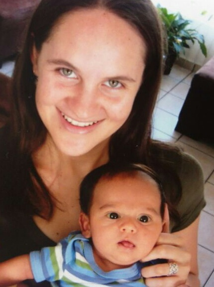
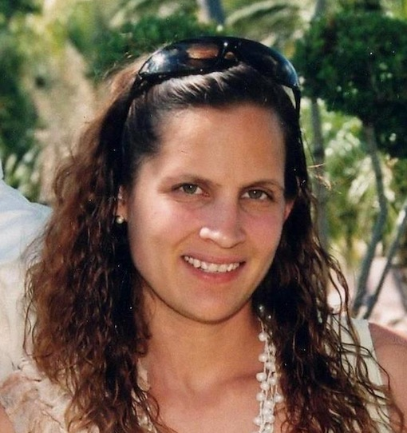

# Sobre nosotras

**Somos madres, mujeres, hijas, esposas, hermanas, amigas, compañeras capacitadas y deseamos acompañarte desde nuestra vivencia y experiencia en este tránsito tan importante.**

  

 

Soy Paulina, me embaracé a los 28 años, mi embarazo transcurrió tranquilo, sin sobresaltos, y di a luz a un niño en casa, parto natural. Fue una experiencia llena de sensaciones y aprendizajes,  recibí en mis brazos a mi niño, y comenzó el puerperio, del cual me di cuenta no sabía nada y muchas cosas me tomaron por sorpresa, fue cuando me di cuenta de lo mucho que nos preparamos en el embarazo para recibir al niño en el aspecto material pero lo poco que nos organizamos en el aspecto emocional. Todo lo bonito que yo creía que sería ser mamá no concordaba con mi realidad, sentía alegría y tristeza, me sentía acompañada y sola, por nombrar sólo lo más básico.

Grupo de Apoyo a la Crianza, sesiones de Co- escucha, terapias individuales, reuniones con mamás y actividades fuera de casa con mi bebé,  y el proceso de Construcción de la Biografía Humana con el equipo de Laura Gutman fueron recursos que utilicé en mi camino.   

Todo esto me llevó a la conclusión de que necesitamos estar más acompañadas y sostenidas en esta etapa del puerperio, y darme cuenta de lo imprescindible que se hace el indagar en nuestra historia personal si es que deseamos tener una presencia de mayor calidad con nuestros hijos. 

Pienso que el trabajo personal hace que la teoría se materialice en cada uno y se pueda transmitir de manera completa. 

### Formación 

  * Licenciatura en Psicología con Especialidad Clínica. 
  * Diplomado en Educación Emocional como Alternativa para Prevención de la Violencia Intrafamiliar.
  * Especialista en Acompañamiento Emocional en el Postparto (Enfoque Laura Gutman).
  * Curso Psicoprofiláctico.
  
  

  

  

Soy Gabriela. Madre de 3 hijos, con tres experiencias diferentes de nacimiento. El primero  psicoprofiláctico, el segundo por cesárea y el tercero natural. Todos alimentados al seno materno.

Tomé el curso psicoprofilactico para apoyar a mi bebé y entender mejor los cambios que me ocurrían.

La experiencia de vivir los diferentes tipos de partos me permiten tener mayor empatía y entender  las necesidades de otras mujeres. Uno de mis hijos fue monitoreado en el último trimestre del embarazo, lo que me hizo estudiar el desarrollo del bebé de forma integral, desde su concepción hasta el nacimiento.  

He acompañado tanto a mamás como a bebés en su adaptación a esta nueva etapa; he tenido la oportunidad de convivir con mujeres de ciudad en donde los medios "facilitan" este proceso, el cual es muy diferente al que viven las mujeres del campo. 

Me  doy cuenta, que  la sociedad influye de manera importante en la etapa del postparto. Este periodo, se puede vivir de muchas maneras.  Creo que después del parto viene el comienzo de una nueva oportunidad para crecer, despertar y conocer. Te enfrentas a mil dudas, no sabes dónde buscar respuestas, ni en quien creer.  

La vida con un recién nacido no siempre es como la imaginamos. El apoyo psíquico y emocional puede ayudar mucho a la recuperación y bienestar, sobre todo a crear un vínculo con el bebé  que será fundamental  en su desarrollo. 

Lo esencial  en este trayecto es poner  atención a nuestro instinto materno.

### Formación

  * Carrera técnica en Puericultura y Pedagogía.
  * Guía Montessori por la AMI (Asociación Montessori Internacional) 
  * Diplomado en estimulación temprana por la Universidad de las Américas A.C. 
  * Curso/Taller de Neurohabilitación por el Instituto de Neurología de la UNAM.            
  * Curso/Taller de superación humana familiar por la Academia Superación Humana S.A de C.V y comunicación en el núcleo familiar.       
  * Taller de terapia de juego, cuento, arte, música y movimiento.
  * Experiencia laboral: en salones de clases y terapias de estimulación,aprendizaje y juego en el centro psicopedagogico O.L.A (Orientación-Lenguaje-Aprendizaje).

 
